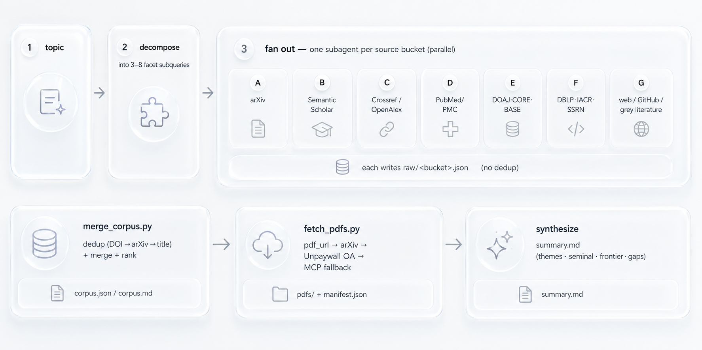
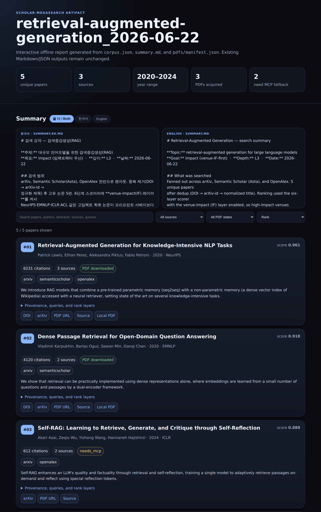

<h1 align="center">scholar-megasearch</h1>

<p align="center">
  <strong>Massive multi-source academic literature search for Claude Code and Codex.</strong><br>
  <em>One skill that fans out subagents across 20+ scholarly databases, merges everything into a single deduplicated corpus, and acquires the original PDFs.</em>
</p>

<p align="center">
  <a href="./README.ko.md">한국어 README</a>
  &nbsp;·&nbsp;
  <a href="./skills/scholar-megasearch/SKILL.md">SKILL.md</a>
  &nbsp;·&nbsp;
  <a href="./skills/scholar-megasearch/references/sources.md">Source catalog</a>
  &nbsp;·&nbsp;
  <a href="./skills/scholar-megasearch/references/orchestration.md">Orchestration</a>
</p>

<p align="center">
  
  
  
  
</p>

<p align="center">
  
  
  
  
</p>

<p align="center">
  
  
  
  
  
  
  
  
</p>

---

> **One sentence:** ask Claude Code or Codex for a topic, and get back a single
> impact-ranked (venue-IF-aware), deduplicated, provenance-tracked corpus of papers —
> with the PDFs already on disk.

- 🔭 **20+ databases in one pass** — arXiv, Semantic Scholar, Crossref, OpenAlex, PubMed/PMC, bioRxiv/medRxiv, DOAJ, CORE, BASE, OpenAIRE, Zenodo, Unpaywall, HAL, DBLP, IACR, SSRN, CiteSeerX, Europe PMC, plus web/GitHub.
- 🏆 **Venue impact (IF) first** — a sixth ranking layer scores each paper by the impact factor of its venue: **188 top CS/AI conferences** from the BK21 list (IF 1–4; AAAI, CVPR, NeurIPS, ICML, ACL, …, +ICLR/COLM) and **live OpenAlex journal IF** (the JIF-equivalent metric, for TPAMI, JMLR, Nature MI, …). Use `--goal impact` to surface high-IF-venue papers first.
- 🧵 **Subagent fan-out** — one searcher per source bucket, running in parallel, so breadth doesn't cost you serial wall-clock.
- 🧹 **Dedup with provenance** — merged by DOI → arXiv-id → normalized title; every paper records *which* databases surfaced it.
- 📊 **Six-layer ranking** — provenance (independent-DB corroboration), citation impact, recency, access, topic relevance, and venue impact — so good papers rank by substance, not SEO.
- 📄 **Original PDFs** — top-K acquired automatically via open-access routes, with a manifest of what landed and what needs a paywall fallback.
- 🧭 **AI-aware routing** — an `ai-research` profile pulls the right ML/CS subset (arXiv, Semantic Scholar, DBLP, OpenAlex, GitHub), with physics, life sciences, crypto, economics, and math still covered.

## Why It Exists

Searching one database at a time is how good papers get missed. arXiv won't show
you the published version's citation count; Semantic Scholar won't surface the
bioRxiv preprint; Google Scholar won't tell you which of its hits also appear in
three other indexes. So you end up running the same query in five tabs, copy-pasting
into a doc, hand-deduplicating, and then hunting each PDF down separately.

`scholar-megasearch` collapses that into one request. It treats "search the
literature" as a fan-out problem: decompose the topic, send each **source bucket** to
its own subagent, and reconcile everything afterward. The output isn't a chat reply —
it's a corpus on disk where every entry is deduplicated, ranked by how many
independent databases corroborate it, and backed by a downloaded PDF wherever a free
route exists.

## How It Works

<p align="center">
  
</p>

Orchestration runs as a deterministic **Workflow** when available, and falls back to
direct **Agent/subagent** fan-out otherwise. A domain → bucket routing table picks the
right 4–7 buckets per topic.

### Dedup & ranking

Records from different databases are merged when they share **any** of: a normalized
DOI, an arXiv id (version-stripped), or a normalized title. The merged record keeps
the richest value per field — the longest abstract, the most complete author list,
the maximum citation count — and accumulates the **set of sources** that found it.
Ranking is then `(number of sources, citation count, year)`, descending. Pass
`--min-sources 2` to keep only papers corroborated by two or more databases — a
high-precision shortlist that filters out single-index noise.

### A typical run

A mid-depth sweep (≈ **L3 Deep**) on a focused topic looks roughly like this *(illustrative)*:

```
topic: "graph neural networks for molecular property prediction"
  facets:  6 subqueries        buckets: A B C E G (5 searchers)
  raw hits: ~310 across buckets
  unique:   ~150 after dedup   (≈60 corroborated by ≥2 databases)
  PDFs:     22 / 25 acquired   (3 flagged needs_mcp — paywalled)
  output:   ./literature_search/gnn-molecular-property_2026-05-29/
```

## Install

```bash
git clone https://github.com/SimonCreater/DongCheol_MetaSearch.git
cd DongCheol_MetaSearch

# Claude Code (default, backwards-compatible)
bash setup/install.sh you@example.com

# Codex
bash setup/install.sh --target codex --email you@example.com

# Both hosts
bash setup/install.sh --target both --email you@example.com

# If your default python3 is too new/old, pin the venv interpreter explicitly
PYTHON_BIN=python3.11 bash setup/install.sh --target codex --email you@example.com
```

The installer preserves the original Claude Code behavior by default. For Claude Code,
it installs skills into `~/.claude/skills/`, builds `~/.claude/skill_venv` and
`~/.claude/paper_search_mcp_venv`, and writes `setup/mcp.servers.resolved.json` for
`~/.claude.json`.

For Codex, it installs personal skills into `$HOME/.agents/skills` by default, builds
the search venvs under `${CODEX_HOME:-~/.codex}`, and writes
`setup/mcp.servers.codex.resolved.toml` for `~/.codex/config.toml`. If the `codex`
CLI is available, add `--register-codex-mcp` to have the installer run `codex mcp add`
for `arxiv-mcp-server`, `asta`, and `paper-search-mcp`.

Both hosts use `paper-search-mcp` from git main — the PyPI build lacks
Crossref/OpenAlex — plus `arxiv-mcp-server` via `uvx`. Semantic Scholar (Bucket B) is
the **remote** [Ai2 Asta MCP](https://allenai.org/asta/resources/mcp): nothing to
install, and it works **without a key** (rate-limited). For higher rate limits, request
a free key and add a literal `x-api-key` header to the `asta` entry. Asta use is
subject to Ai2's terms (see [Attribution](#attribution)).

**Requirements**

| | |
|---|---|
| Python | 3.11+ |
| [`uv`](https://astral.sh/uv) | for `uvx arxiv-mcp-server` |
| `git` | `pip install` of `paper-search-mcp` (git main) at install time |
| Claude Code or Codex | the skill is triggered from within a session |

## Usage

Inside Claude Code or Codex, trigger the skill in natural language:

```
search every database for graph neural networks and grab the PDFs
do a massive literature search on mixture-of-experts routing from the last year, with PDFs
```

The skill also understands trigger phrases in other languages, so a request written in,
say, Korean or Japanese routes to the same pipeline.

If the request is underspecified, the skill asks a short mini-survey before fan-out:
**field**, **goal**, and numeric **depth 1–5**. The same plan can be generated from a
terminal:

```bash
python3 ~/.claude/skills/scholar-megasearch/scripts/plan_run.py \
  "graph neural networks" --field cs-ml --goal survey --depth 3
```

Or invoke it as a **slash command**, optionally pinning the depth level (see
[Depth levels](#depth-levels)) — prepend `depth=N`, `LN`, or a bare `1–5`, or use a
phrase like `quick` / `exhaustive`. Everything after the command is the topic:

```
/scholar-megasearch depth=4 graph neural networks for molecular property prediction
/scholar-megasearch L5 CRISPR-Cas9 off-target prediction methods   # L5 = grab every source's PDFs
/scholar-megasearch quick first look at retrieval-augmented generation
/scholar-megasearch exhaustive measurement of topological insulator surface states  # → L5
/scholar-megasearch mixture-of-experts routing papers from the last year   # no level → defaults to L2
```

Or run the scripts directly:

```bash
# merge per-source result files into one ranked corpus
python3 ~/.claude/skills/scholar-megasearch/scripts/merge_corpus.py \
  ./literature_search/<topic>_<date>/raw \
  -o corpus.json --md corpus.md --min-sources 2 \
  --goal survey --topic "graph neural networks"

# recover partial results when MCP sources are unavailable
python3 ~/.claude/skills/scholar-megasearch/scripts/resilient_search.py \
  "graph neural networks" --sources arxiv,semanticscholar,ddg \
  -o raw/local_recovery.json --status raw/local_recovery.status.json

# acquire original PDFs for the top 25 ranked papers
python3 ~/.claude/skills/scholar-megasearch/scripts/fetch_pdfs.py \
  corpus.json -o ./pdfs --email you@example.com --top 25

# render a self-contained HTML report for a completed run
python3 ~/.claude/skills/scholar-megasearch/scripts/render_artifact.py \
  ./literature_search/<topic>_<date>

# preview the HTML report at http://127.0.0.1:8765/
python3 ~/.claude/skills/scholar-megasearch/scripts/render_artifact.py \
  ./literature_search/<topic>_<date> --serve --open

# Codex default script path is:
# ~/.agents/skills/scholar-megasearch/scripts/
```

### Depth levels

One knob scales **breadth** (facets × buckets × hits per query) and **recursion**
(extra waves) together. Pick a level per run — an explicit `depth=N` / `LN` / bare
`1–5` wins; otherwise it's inferred from phrasing (`quick` → L1 …
`every source` / `exhaustive` → L5, including equivalent phrases in other
languages); otherwise it defaults to **L2**.

| Level | Facets | Buckets | Hits/query | Waves | PDFs | Output |
|-------|:------:|:-------:|:----------:|-------|:----:|--------|
| **L1 · Quick** | 3 | 4 | 15 | wave 1 only | top 10 | corpus |
| **L2 · Standard** *(default)* | 5 | 5 | 25 | wave 1 only | top 30 | corpus |
| **L3 · Deep** | 6 | 6 | 30 | + citation snowball | top 50 | corpus |
| **L4 · Exhaustive** | 8 | 7 (all) | 40 | + snowball + completeness-critic pass | top 100 | corpus + ≥2 shortlist |
| **L5 · Total** (Exhaustive) | 8 | 7 (all) | 40 | + snowball + critic loop-until-dry | all sources | corpus + ≥2 shortlist |

Each wave is a fan-out followed by a merge into the *same* corpus: the **citation
snowball** (L3+) seeds the top DOIs/arXiv ids back through citation graphs; the
**completeness-critic** (L4+) names missing subtopics/authors that become the next
wave's facets, looped until dry at L5. L4/L5 also emit a `--min-sources 2` shortlist.
Higher levels spawn more subagents and cost more tokens — L5 is bounded only by the
token budget. **PDF acquisition scales with the level too** — `fetch_pdfs.py --top` of
10 / 30 / 50 / 100, and `all` (the whole corpus) at L5.

### Ranking

The default merge ranking is a **six**-layer weighted score: provenance, impact,
recency, access/completeness, topic relevance, and **venue impact (IF)**. Goal profiles
(`survey`, `systematic`, `newest`, `seminal`, `implementation`, `pdf-corpus`, and
**`impact`**) shift the layer weights while keeping the signals separate. Use
`--ranking classic` to reproduce the older `sources_count, citations, year` sort.

### Venue impact (IF) — surface high-impact-venue papers first

The sixth ranking layer scores each paper by the impact factor of the venue it appeared
in, from two tables — **on by default**, with non-listed papers still kept (additive
boost, not a hard filter):

- **BK21 conferences** (`references/venue_impact.json`) — 188 top CS/AI conferences with
  recognized IF 1–4 (AAAI, CVPR, NeurIPS, ICML, ACL, KDD, …; +ICLR/COLM that postdate
  the list), built from the BK21 stage-4 PDF by `scripts/build_venue_impact.py`. A
  matched venue scores `IF / 4`; the BK21 deduction rule (Short −1, Spotlight −2,
  Poster 0) applies when the venue text names the presentation type.
- **OpenAlex journals** (`references/journal_impact.json`) — per-source
  `2yr_mean_citedness` (the JIF-equivalent metric), log-normalized with an h-index
  fallback, covering journals BK21 omits (TPAMI, JMLR, IJCV, Nature MI, …). Clarivate's
  Master Journal List JIF is login-gated with no free bulk API, so OpenAlex's metric is
  the automatable IF proxy.

For AI work, use `--field ai-research --goal impact`. Refresh the journal cache for a
run's venues before merging:

```bash
python3 ~/.claude/skills/scholar-megasearch/scripts/enrich_if.py \
  ./literature_search/<topic>_<date>/raw --email you@example.com
python3 ~/.claude/skills/scholar-megasearch/scripts/merge_corpus.py \
  ./literature_search/<topic>_<date>/raw -o corpus.json --goal impact --topic "<topic>"
# --no-venue-impact drops the layer (weights rescale over the other five)
```

## Outputs

Everything lands under `./literature_search/<topic>_<date>/` in the working directory:

```
literature_search/<topic>_<date>/
├── raw/<bucket>.json     # per-source hits (one file per subagent)
├── corpus.json           # deduplicated, ranked, provenance-tracked corpus
├── corpus.md             # human-readable digest
├── pdfs/                  # acquired original PDFs + manifest.json
├── artifact/index.html     # optional self-contained HTML viewer
├── summary.md            # synthesized review (English)
└── summary.ko.md         # optional Korean review — shown alongside English in the HTML viewer
```

PDFs are named `NN_<slug>.pdf` by their `corpus.json` rank, and `summary.md` numbers each
paper `[#NN]` with the same rank — so a summary entry maps directly to its `pdfs/NN_*.pdf`
file and its `manifest.json` row.

### HTML artifact viewer

`render_artifact.py` turns any completed run into a single self-contained
`artifact/index.html` — a dark-themed, offline report with live search, source/PDF/sort
filters, the six ranking layers (incl. **venue impact / IF**) per paper, and PDF-status
badges. Nothing is uploaded; the existing Markdown/JSON outputs are untouched.

```bash
# render an HTML report for a completed run
python3 ~/.claude/skills/scholar-megasearch/scripts/render_artifact.py \
  ./literature_search/<topic>_<date>

# ...or preview it on localhost and open it in the browser
python3 ~/.claude/skills/scholar-megasearch/scripts/render_artifact.py \
  ./literature_search/<topic>_<date> --serve --open
```

**Bilingual summary.** If the run directory contains both `summary.md` (English) and
`summary.ko.md` (Korean), the viewer shows **both at once**, with a `둘 다 / Both ·
한국어 · English` toggle to switch. With only one present, it shows just that language.

**Example** — a sample "retrieval-augmented generation" run: run stats, the Korean +
English summary panels side by side with a language toggle, and the ranked paper cards
below (score, citations, sources, PDF badge, and the six ranking layers per paper):

<p align="center">
  
</p>

See the [full-page screenshot](./docs/artifact-example.png) (all five papers), or open the
live report:
[rendered](https://htmlpreview.github.io/?https://raw.githubusercontent.com/SimonCreater/DongCheol_MegaSearch/main/docs/example-artifact.html)
· [source](./docs/example-artifact.html).

## Source Buckets

| Bucket | Databases |
|--------|-----------|
| A · Preprints | arXiv (search · semantic · citation graph) |
| B · Citations | Semantic Scholar via **Ai2 Asta** (official MCP) + paper-search-mcp |
| C · DOI / published | Crossref, OpenAlex |
| D · Life sciences | PubMed, PMC, bioRxiv, medRxiv, Europe PMC |
| E · Open access | DOAJ, CORE, BASE, OpenAIRE, Zenodo, Unpaywall, HAL |
| F · Domain | DBLP (CS), IACR (crypto), SSRN (econ/law), CiteSeerX |
| G · Web | DuckDuckGo, GitHub, crawl4ai / firecrawl |

### Domain → bucket routing

| Topic domain | Always | Plus |
|---|---|---|
| Physics / materials / cond-mat | A · B · C | E · G |
| CS / ML / systems | A · B · F (DBLP) | C · G (GitHub) |
| Biology / medicine / neuro | D · B · C | E |
| Cryptography / security | A · F (IACR) · B | G (GitHub) |
| Economics / social science / law | F (SSRN) · B · C | G |
| Math | A · B · C | F |
| Interdisciplinary / unknown | A · B · C · D | E · G |

Full per-bucket tool lists are in
[`skills/scholar-megasearch/references/sources.md`](./skills/scholar-megasearch/references/sources.md);
the orchestration templates (Workflow + Agent fan-out) and the record schema are in
[`references/orchestration.md`](./skills/scholar-megasearch/references/orchestration.md).

## Repository Layout

```
scholar-megasearch/
├── README.md · README.ko.md · LICENSE
├── setup/
│   ├── install.sh            # skills + venvs + MCP servers + resolved config
│   ├── requirements.txt      # pinned search/acquisition deps
│   ├── mcp.servers.json          # MCP template for ~/.claude.json
│   └── mcp.servers.codex.toml    # MCP template for ~/.codex/config.toml
└── skills/
    ├── scholar-megasearch/   # the skill
    │   ├── SKILL.md
    │   ├── references/{sources.md, orchestration.md,
    │   │               venue_impact.json, journal_impact.json}   # IF tables
    │   └── scripts/{merge_corpus.py, fetch_pdfs.py, render_artifact.py, search_local.py,
    │                venue_impact.py, build_venue_impact.py, enrich_if.py}  # IF layer
    └── arxiv-search/          # supporting venv-search skill
```

This repository contains only original MIT-licensed work (the two skills and the
setup scripts). The third-party MCP servers are **not** vendored — `setup/install.sh`
fetches the local ones (arxiv-mcp-server, paper-search-mcp) from upstream at install
time, and Semantic Scholar is the remote Ai2 Asta service. See [Attribution](#attribution).

## Notes & Limitations

- **PDF acquisition is open-access-first.** `fetch_pdfs.py` only uses free/legal
  routes (a known OA `pdf_url`, arXiv, Unpaywall) and verifies every file is a real
  `%PDF-`. Closed-access papers are flagged `needs_mcp` in the manifest; fetching
  those is left to the session's MCP download tools.
- **arXiv rate-limits heavy fan-out** (HTTP 429). Searchers stagger and lean on
  Semantic Scholar / OpenAlex when arXiv pushes back.
- **`paper-search-mcp` must be the git-main build** — the PyPI release omits
  Crossref and OpenAlex. The installer handles this.
- **Host-specific scholar gateways are best-effort** — they may be absent in
  headless/cron runs, so they are never a bucket's only source.
- **HTML artifacts are opt-in.** `render_artifact.py` writes a static
  `artifact/index.html` report from an existing run directory. It starts no server unless
  `--serve` is passed; the preview server binds to `127.0.0.1` by default and serves only
  the run directory so sibling PDF links can resolve.
- **Honest synthesis.** `summary.md` reports what was actually searched and which
  sources failed; nothing is invented to fill a gap.

## Attribution

The MCP servers are third-party — installed from their upstream sources by
`setup/install.sh`, or (for Asta) used as a remote service. None of their code is
redistributed here:

- **Ai2 Asta Scientific Corpus Tool** — the official Semantic Scholar MCP by the
  [Allen Institute for AI](https://allenai.org/asta/resources/mcp), used as a remote
  service under Ai2's [Asta License Agreement](https://allenai.org/asta-corpus-license)
  and [Terms of Use](https://allenai.org/terms) (no code vendored).
- **paper-search-mcp** — [openags/paper-search-mcp](https://github.com/openags/paper-search-mcp) (pip install from git main)
- **arxiv-mcp-server** — launched on demand via `uvx`

**Semantic Scholar data** returned through Asta is licensed **ODC-BY** and governed by the
[Semantic Scholar API license](https://www.semanticscholar.org/product/api/license): when
you publish results built on it, **attribute Semantic Scholar** (link back to
semanticscholar.org) and do **not** redistribute, sell, or sublicense the raw data.
Individual papers/abstracts may carry their own licenses (e.g. CC BY-NC).

Original work in this repository (the `scholar-megasearch` and `arxiv-search` skills
and the setup scripts) is released under the [MIT License](./LICENSE) — this covers our
code only, not the third-party services or the data they return.
